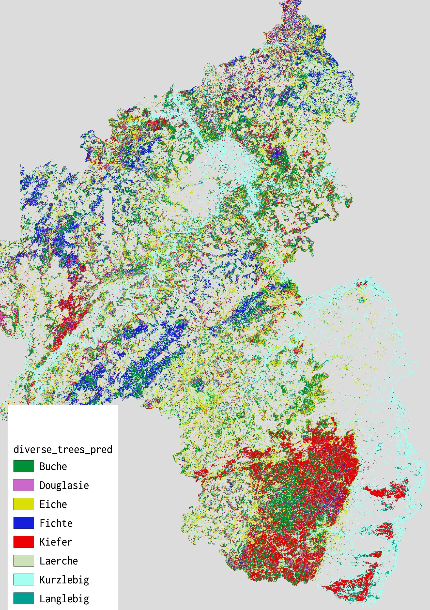

# Data Basis

## Predictors

* Sentinel-2 for winter and summer 2019
** Vegetation indices from R package RStoolbox

* Lidar Data from RLP (data at hand)
** From multiple years (2013 - 2019)
** some parts at the border to Luxemburg are missing
** Lidar indices from RSDB (no intensity based indices)


## Observations

* Forest inventory for all state-owned forest (~ 60% of all forest in RLP)
** Tree species
** Waldwachstumsphase


## Supplementary

* Hansen - Global forest cover
* Bundeswaldinventur

# Stage 1: Getting the forest

* Reduced predictors to areas where there is forest in the Hansen-Set
* Reduced observation polygons to those with 80% species purity
* Combined subclasses (e.g. _Quercus petraea_ and _Quercus robur_)


# Stage 2: Modelling approach

### Hirachical modelling:
1. Modell the tree species
** One model with main species (_Fagus_, _Quercus_, _Pseudotsuga_, _Picea_, _Pinus_)
** One model with main species + lesser species (_Larix_, _Deciduous short living_, _Deciduous long living_)

2. Modell the quality classes within the species
** 2 or 3 quality classes for each tree species
** These model are only valid where the tree species models predict the actual tree species
** Reasoning: Forest quality stages are much harder to identify + there are less training areas for each quality class. This way we get robust models for tree species and still predict forest quality

Since the tree species are not equally distributed (e.g. much more Polygons with _Fagus_ than _Picea_) the class with the lowest and smallest polygons determines the sampling size. In each model, the same amount of pixel per class gets sampled.


# Stage 3: Modelling

* Random Forest with FFS
* 10-Fold Leave Locations Out Cross Validation
* Area of Applicability for each model
* Independent validation with the polygons which did not get sampled previously (much more than the training set)


# Model Examples

## Tree species

```{r, echo = FALSE}

meta = yaml::read_yaml("../data/validation/meta_classes_diverse_meta.yaml")
meta = yaml::yaml.load(meta)

print(meta)

val = readRDS("../data/validation/meta_classes_diverse_confusionmatrix.RDS")
print(val)

```

## Forest quality


```{r, echo = FALSE}

meta = yaml::read_yaml("../data/validation/quality_beech_meta.yaml")
meta = yaml::yaml.load(meta)

print(meta)

val = readRDS("../data/validation/quality_beech_confusionmatrix.RDS")
print(val)

```


## Tree species prediction



## AOA Example


